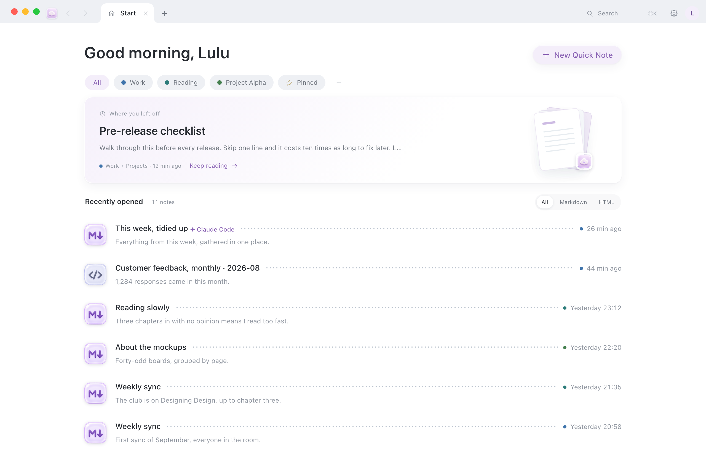
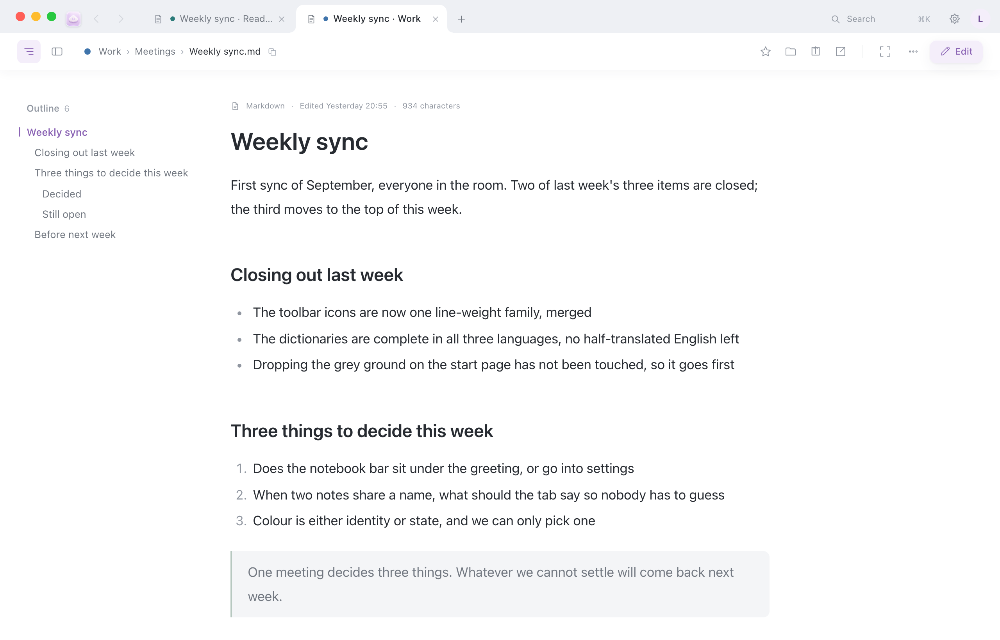
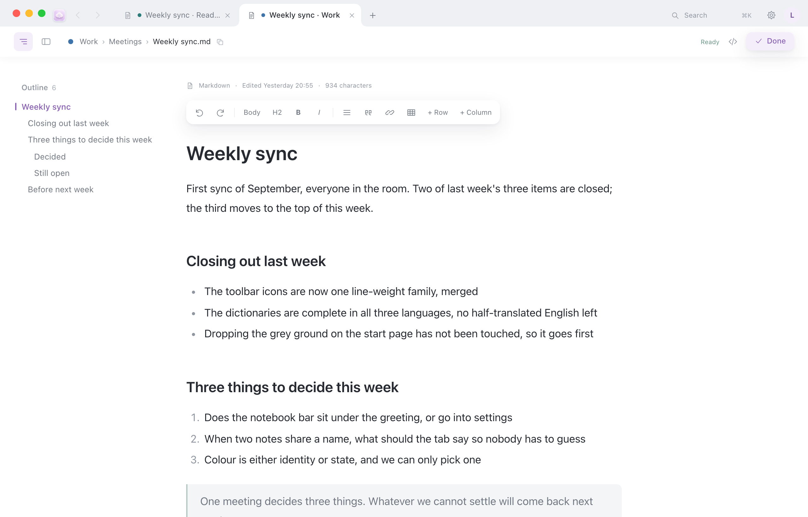

<p align="center">
  <a href="README.md">简体中文</a> ·
  <a href="README.zh-HK.md">繁體中文（香港）</a> ·
  <b>English</b>
</p>

<p align="center">
  
</p>

<h1 align="center">AM·Note</h1>

<p align="center">
  A local Markdown note browser for macOS.<br>
  Point it at a folder on your Mac, or at several, and search, read and edit them all in one window.<br>
  Your files stay where they are. Nothing moves, nothing is uploaded.
</p>

<p align="center">
  <a href="https://github.com/Qiululu667/amnote/releases"></a>
  <a href="LICENSE"></a>
  
</p>

## The problem it solves

You already have a pile of `.md` files, plus a few `.html` pages exported from somewhere else. They sit in Downloads, on the Desktop, inside some project folder, each minding its own business.

To find one sentence you first have to remember which folder it's in. To fix one paragraph you have to pick an editor and open it. A cloud notes app would happily hold all of it — but only after you move the files in, and once they're in, they aren't your files any more.

AM·Note doesn't move anything. Pick a folder and you get a window as light as a browser: ⌘K searches that folder, and the tabs show the very same files. When you're done editing, they're still the same files. If your folders are scattered, add a few of them and read them all in one window.



## How it works

1. The first time you open it, pick a folder — or let it make one for you. Any folder will do, including an empty one. That folder is your first **notebook**.
2. It creates one `.amnote/` folder inside for the index and edit backups. Not a single byte of your notes is touched.
3. The window is two rows: tabs, search and settings on top; below them, where this file lives and what you can do with it. Every note gets its own **tab**. Press **⌘K** to search the whole folder.
4. To read folders that live elsewhere as well, add another notebook. With a single notebook, the interface and the paths are exactly what they were.

## What you can do

**Find**

- ⌘K is the one and only way in. Start typing and the first row reads "Search all notes for “…”" — Return searches the full text, ⌘ Return searches in a new tab.
- Under that first row are actions and note titles. Arrow keys to choose, Return to open. It matches file names and body text, in this folder — not on the web.
- You can also just type on the Start page; the first keystroke brings the panel up.
- Below the greeting on the Start page is a row of folder chips: the top-level folders in your vault, with "Pinned" last. Click one to see what's inside, ⌘-click to open it in a new tab. If it has subfolders they appear on the next row, with breadcrumbs above to step back out.
- The Start page, a folder and "Pinned" are all a table of contents: one note per row, with a small badge on the left (a thick little tile of glass: pale lilac with an `M↓` floating in it for a .md, grey with a `</>` for an .html), the title in the middle, a run of dots leading your eye to the time on the right, and one grey line underneath: the first sentence of the note. It still filters by "All / Markdown / HTML".

**Read**

- Both .md and .html open in tabs. Web pages in your vault render as they are — no conversion.
- Vault HTML renders in a sandbox: scripts run and charts draw, but the page can't reach `localStorage`, `sessionStorage`, `cookie` or `indexedDB` (touching them throws a SecurityError), and it can't call the local server. Anything worth keeping goes in a .md — don't let the page remember it for you, because next time it won't.
- The Start page has "Recently opened" plus a big "Where you left off" card — the note you were last in is right there, and "Keep reading" takes you back. The time in the list is when you last opened that note, and the one on the card isn't listed again below.
- The Start page shows no status most of the time; a small dot appears next to the greeting only while it's tidying up ("Indexing…") or when the service isn't running. There's no status bar at the bottom of the window either.
- Right-click a note and choose Pin (the star on the right of the document header does the same); everything you pin lives behind the "Pinned" chip.
- The row above the text is the document header: on the left, the outline toggle, the Related toggle and this file's path — click the path to copy it, ⌘-click one of the folder segments to open that folder in a new tab. On the right: pin, Reveal in Finder, Share, Open in New Window, then focus, "⋯" and "Edit".
- The outline sits on the left: heading levels at a glance, the section you're reading highlights itself, click to jump. ⌥⌘I hides it or brings it back.
- "Related" sits on the left too: what surrounds this note — the folder it lives in (which unfolds into the whole notebook's file tree, with this note highlighted), other versions of the same note (`_v1`, `v3 final`, a `20260827_` prefix, a same-named .html — they all gather together), and what it links to and what links back. It stays closed until ⌥⌘R calls it up; it shares the left column with the outline, one at a time.
- Focus mode: click ⤢ and the document header, the outline and Related slide away, leaving only the text. Nudge the top of the window with the pointer to bring them back; Esc leaves.
- A `- [ ]` in the text is a checkbox you can actually click: tick it while you read, the words grey out and get a line through them, and that line's `[ ]` becomes `[x]` in the file — one character, nothing else. Return in edit mode starts the next one.



**Write**

- Double-click the text to start editing, with the cursor in the paragraph you clicked. ⌘E works too.
- Select text and a format bar floats up: bold, headings, lists, quotes, links, tables, add row, add column.
- Stop typing for two seconds and it saves, with "Saved 14:29" in the top right. ⌘S saves right now; click "Done" when you're finished.
- If the file was changed in another editor meanwhile, saving stops to ask, and you choose "Keep Mine" or "Use Theirs".
- Click "View Markdown source" to edit the whole file as source, then switch back.
- Paste a screenshot straight into the text; the image lands in `_图/` ("images") next to that note.



**Organize**

- ⌘T opens a new tab on the Start page. Click "New Quick Note" and write a first heading — the file renames itself to match.
- ⌘⇧T brings back the tab you just closed.
- Reveal in Finder, Share and Open in New Window are the small icons on the right of the document header; to copy the path, just click the path. Print and "Open Enclosing Folder" live under "⋯".
- A quick note you didn't mean to make: "⋯" → Move to Trash, or press ⌘⌫. You can undo from the toast for a few seconds, and it's in the system Trash either way.
- Double-click a `.md` in Finder to open it here. It opens in a new tab, so whatever you were reading stays where it was.

**Several notebooks**

- Every folder you add is a **notebook**. Add a second one and a notebook bar appears under the greeting on the Start page: `All | ● Work | ● Reading | ☆ Pinned | ＋`. Folder chips, the list, the search scope and where a new note lands all follow it.
- Each notebook has a color, and its dot travels with it — in the list, on the path chip, on tabs and in ⌘K results — so you always know which one you're in. Purple still means "selected" and nothing else.
- "All" is the overview: “Where you left off”, Recently opened and search span every notebook. Pick one notebook to get folder chips back — at that moment the page is the Start page you already know.
- A new quick note (⌥⌘N) lands in whichever notebook the bar has selected, or in the default one while "All" is showing. The toast reads "New note in ● Work", and "Move it" sends it to another notebook.
- With two or more, paths start with the notebook name, like `Work/Meetings/Weekly.md`. Each notebook keeps its own `.amnote/`. When a folder is missing — an external drive that isn't plugged in — its chip dims and reads "Not found"; nothing is removed for you.
- **With a single notebook, everything is exactly as it was**: no notebook bar, no color dots, no prefix on paths.

**Settings**

- ⌘, opens it, or click the ⚙ in the top right. Six panes: Profile, Appearance, Vault, Agent, Advanced, About.
- Profile: give yourself a name and a picture, and the Start page greets you by time of day (“Good morning, Lulu”). It never leaves this Mac.
- Appearance: **interface language** (System / 简体中文 / 繁體中文（香港） / English — the menus and dialogs of the app switch with it), theme (System / Light / Dark), reading font, text size 15–21, line spacing Compact 1.6 / Comfortable 1.8 / Loose 2.0, column width Narrow 620 / Regular 690 / Wide 820, and "Show the outline when a note opens". Switch to dark and the title bar goes with it — window and page are one piece.
- **Five reading fonts**, each previewed on its own card: System, Serif, Monospace, and new in 5.5 **PingFang HK** (with six weights, from Ultralight to Semibold) and **PMingLiU**. If PMingLiU isn't installed, AM·Note borrows it from a copy of Microsoft Office you already have; without Office it falls back to Songti TC.
- Vault: which folders you're using — adding, renaming, recoloring, making one the default and removing all live here; how many notes were indexed and when it last ran, plus a button to run it again; where quick notes go; which folders to leave out (those last two are kept per notebook).
- Advanced is folded away by default — skipped files and the local service port are in there. One process, one port: only the first notebook's port setting counts. About has the version, "Check for Updates" and the automatic-update switch.

## What it doesn't do

- No sync, no upload, no account. It's fully offline, except when you press "Check for Updates".
- It doesn't copy your files or reorganize your folders.
- It doesn't lock you in. The same file can be opened in another editor any time, and you can use both at once (it will tell you when they disagree).
- It only renders `.md` and `.html`. Other file types are still indexed and searchable, but they aren't listed in the window and aren't rendered.

## Install

Download `AMNote-mac.zip` from [Releases](https://github.com/Qiululu667/amnote/releases) and unzip it to get `AM·Note.app`.

**The first time, right-click the icon → Open**, don't double-click. There's no paid Apple signature, so macOS asks once; click Open and you're through.

Requires macOS 12 or newer. No account, no network.

To build it yourself: run `python3 src/build_app.py` in the repo root; the app lands in `dist/`.

## The first launch

1. Right-click `AM·Note.app` → Open.
2. A welcome card offers two choices: **Create a Vault**, which makes an `AM·Note` folder in Documents with a welcome note inside; or **Use an Existing Folder**, which lets you pick a folder that already holds Markdown files or web pages.
3. It indexes once, tells you how many notes it found, and drops you on the Start page. The first time, there's also a small "New here? Three things and you're set" card — click "Got it" and it won't come back.

Your choice is remembered. Next time it opens on the Start page; it won't jump you back into the last note.

An empty folder works too: you can search (0 results) and create quick notes. New quick notes go into `随手记/` ("quick notes") inside the folder you chose, created on demand.

If that folder gets moved or deleted, AM·Note doesn't quit — it just asks whether you want to "Choose Another Folder…" or "Create a Vault". Your files are fine; it simply can't find the folder.

With two or more notebooks, only that one is affected: its chip dims and reads "Not found", its row in Settings offers "Relocate…", and the others carry on.

Want to try it first? Point it at [`examples/demo-vault/`](examples/demo-vault) in this repo.

## Managing notebooks

Settings (⌘,) → Vault. With two or more notebooks, that pane is a list of them: the color square opens the eight-color palette, the name is editable in place, the gray path opens the folder in Finder, and on the right are "Make Default" and "Remove". "Add Notebook…" sits under the list, and the menu item Vault → Add Notebook… does the same thing.

Removing one only unregisters it: the files stay put, `.amnote/` stays with them, and adding the folder back later picks up where you left off. At least one notebook has to remain. A notebook whose folder has moved is dimmed, and its row offers "Relocate…".

With a single notebook the pane is the same "Current vault" card as before, "Change Folder…" included.

## Updates

AM·Note → Check for Updates…, or the same button on the About pane of Settings. A new version installs in place: the app quits, reopens, and your notes are still in the same folder.

From the second launch on, it asks GitHub Releases about once a day. "Check for Updates Automatically" can be turned off in the menu or in Settings. It only asks for a version number and a package — it never uploads anything.

If you're on an older build, you'll need to download a version with "Check for Updates" once by hand (5.1.0 and later); after that you're done with GitHub.

## Keyboard shortcuts

| Key | |
| --- | --- |
| ⌘T | New Tab (Start page) |
| ⌘N | New Window |
| ⌥⌘N | New Quick Note |
| ⌘W | Close Tab (closes the window when only the Start page is left) |
| ⌘⇧T | Reopen the tab you just closed |
| ⌘K | Search / Quick Open |
| ⌘L, ⌥⌘K | Also open the same search panel |
| ⌘E | Start Editing |
| ⌘S | Save |
| ⌘⌫ | Move to Trash |
| ⌘[ / ⌘] | Back / Forward |
| ⌃Tab | Switch tabs |
| ⌥⌘I | Show Outline |
| ⌥⌘R | Show Related |
| ⌘F | Find on Page |
| ⌥⌘O | Open in New Window |
| ⇧⌘R | Reveal in Finder |
| ⌥⌘C | Copy Path |
| ⌘, | Settings |
| Esc | Dismiss overlay / leave focus / stop editing |

Click a note and it opens in the current tab (or switches to it, if it's already open); ⌘-click and it opens in a new tab. The Start page, search results, ⌘K and the Related panel all follow the same rule.

The full list is in the app: Help → Keyboard Shortcuts.

## Where everything lives

Your notes stay in the folder you chose. The only thing added is one `.amnote/`:

| | |
| --- | --- |
| `fulltext.db` | The full-text index |
| `changes.jsonl` | A change log (who touched which file, and when) |
| `backups/` | Edit backups — the last 10 versions of each file |
| `config.json` | This vault's settings (skipped folders, port range, quick-notes folder…) |

Delete `.amnote/` and every note is still there; the next launch just scans again.

- Quick notes go into `随手记/` ("quick notes") inside the vault. The folder name is editable in Settings → Vault.
- Images pasted into the text land in `_图/` ("images") next to that .md file.
- Two more files can show up in the vault root, both of them things you click for in Settings → Agent — otherwise they don't exist: `AGENTS.md` (instructions for an agent running inside this folder) and `库地图.md` ("vault map", an exported map; re-exporting overwrites the whole file, so don't hand-write in it).
- The list of notebooks lives in `~/Library/Application Support/AMNote/notebooks.json`: each one's name, color and path. It records which folders you use, and nothing from the notes themselves.
- The service's port and token live in the same folder as `portal.port` and `portal.token` (the token file is 0600), along with `profile.json` and `avatar.img` — your name and picture, on this Mac only.

## A local API for agents and scripts

While AM·Note is open, AI assistants on this Mac can search this vault and read and write notes in it. Everything stays on this Mac — nothing goes online.

**Three steps**

1. Settings (⌘,) → Agent.
2. On the Claude Code row, click "Install Skill". For Codex or anything else, click "Copy MCP Command" or "Copy MCP Config" and paste it into that tool's own config.
3. Back in Claude Code, just say "find me that release checklist from my notes".

The skill teaches it an order: ask **which notebooks there are**, read the **vault map** to see what folders they hold, then **search** to narrow down, then read **just that one section** — instead of pouring the whole vault into its context.

For an agent that runs inside the vault folder (Codex, Cursor…), "Create AGENTS.md" puts the same rules where it will read them on startup. "Export to Vault" writes the map out as `库地图.md` ("vault map"), so it's readable even when AM·Note isn't running.

**The `amnote` command line**

Settings → Agent → Command Line → "Install" symlinks `~/.local/bin/amnote` to `AM·Note.app/Contents/Resources/amnote` inside the app. You don't have to install it — calling that absolute path works just as well.

```bash
amnote notebooks                              # which notebooks there are, and which one is the default
amnote map                                    # what folders exist, what each note is about
amnote search "报销" --dir 工作手记 --since 7   # spaces = AND; also --type md,pdf
amnote outline 工作手记/报销.md                # the headings in one note
amnote read 工作手记/报销.md --section "发票"   # just that section
amnote recent                                 # what changed lately
amnote new "会议纪要 0906" < body.md           # create one, in the quick-notes folder by default
amnote save 工作手记/报销.md < body.md          # overwrite the whole file; read it first (it remembers the version you saw), or add --based/--force

# Two or more notebooks: paths start with the notebook name, and most commands take -n NAME
amnote read 工作/会议/周会.md
amnote map -n 读书
amnote search "周会" --notebook 工作            # on search and recent, -n means "how many", so write it out
amnote new "会议纪要 0906" -n 读书              # without -n it goes to the default notebook
```

Paths are always **relative to the vault**; with two or more notebooks they start with the notebook name (`工作/会议/周会.md`), and `amnote notebooks` lists the names. Every command takes `--json` for the raw JSON, and `--agent NAME` to sign the change.

When AM·Note isn't running, the read-only commands answer from the last index in `.amnote/` (with a note on stderr). Writes need the app open.

Exit codes: 0 success · 1 usage error (including saving a note you haven't read) · 2 AM·Note isn't running · 3 conflict (the file changed elsewhere since you read it — `--force` overwrites) · 4 the service refused.

**MCP**

```bash
claude mcp add amnote -- /path/to/amnote mcp
```

In Codex's `~/.codex/config.toml`:

```toml
[mcp_servers.amnote]
command = "/path/to/amnote"
args = ["mcp"]
```

Nine tools: `list_notebooks`, `search_notes`, `note_map`, `read_note`, `note_outline`, `recent_notes`, `note_links`, `create_note`, `save_note`. Call `list_notebooks` first when there is more than one; `search_notes`, `note_map`, `recent_notes` and `create_note` each take an optional `notebook`. The two "Copy" buttons in Settings → Agent already have the path filled in.

**Straight HTTP**

For a script, or any other language, call the routes directly. The service listens on `127.0.0.1` only, picks a port between 8870 and 8900 by default, and **never emits CORS headers** — a web page in a browser cannot reach it. Read routes need no token; write routes (every POST) need `X-AMN-Token` in the header.

The JSON field names are Chinese — that's the wire format, so pass them through as they are.

```bash
D=~/Library/Application\ Support/AMNote
P=$(cat "$D/portal.port")
T=$(cat "$D/portal.token")

# Check the service is alive first. Anything but 200 means don't retry —
# call `amnote` instead, which falls back to the last index.
# In /__status, "模式" is "单" (one) or "多" (several), and "笔记本" is the list.
curl -s -m 3 -o /dev/null -w '%{http_code}\n' "http://127.0.0.1:$P/__status"

# Which notebooks there are: name, color, path, note count, which is the default
curl -s "http://127.0.0.1:$P/__notebooks"

# The vault map: one Markdown page of "what's in here". Start with this.
# dir= draws one folder, max= notes per folder (default 20), depth= folder depth
curl -sG "http://127.0.0.1:$P/__map" --data-urlencode "dir=工作手记"

# Search the whole vault. Non-ASCII terms need --data-urlencode;
# n defaults to 200, with a ceiling of 500. Filters: dir=folder, type=md,pdf,
# since=7 or since=2026-09-01, sort=mtime, offset=20
curl -sG "http://127.0.0.1:$P/__search" \
     --data-urlencode "q=检查表" --data-urlencode "n=10" \
     --data-urlencode "dir=工作手记" --data-urlencode "since=7"

# The headings in one note: level, text and line number for each
curl -sG "http://127.0.0.1:$P/__outline" --data-urlencode "path=工作手记/发布检查表.md"

# Read one .md as source. Whole file, or section=<heading> for one section,
# or lines=5-40 for a line range
curl -sG "http://127.0.0.1:$P/__raw" \
     --data-urlencode "path=工作手记/发布检查表.md" --data-urlencode "section=打包"

# What this note points to, and what points at it
curl -sG "http://127.0.0.1:$P/__links" --data-urlencode "path=工作手记/发布检查表.md"

# What changed lately. days defaults to 7 (max 365), n to 50 (max 500)
curl -sG "http://127.0.0.1:$P/__recent" --data-urlencode "days=7"

# What's in the vault: the folder tree, every md/html, and quick notes
curl -s "http://127.0.0.1:$P/__tree"

# Write it back. Needs the token. Put the "改于" you last read into "基于";
# if someone else changed the file meanwhile, the write is refused.
# Send a name and the list will show who made the change.
curl -s -X POST "http://127.0.0.1:$P/__save" \
     -H "X-AMN-Token: $T" -H "X-AMN-Agent: My Script" \
     --data-binary '{"路径":"工作手记/发布检查表.md","正文":"# 标题\n\n正文\n","基于":"2026-09-05 09:42:00"}'

# Move a file to the system Trash. It only moves, never edits;
# accepts .md / .html / .htm
curl -s -X POST "http://127.0.0.1:$P/__trash" -H "X-AMN-Token: $T" \
     --data-binary '{"路径":"工作手记/建错了.md"}'

# Put it back where it was. The undo table lives in memory only — after a
# restart there's nothing to undo, so go to the Trash instead.
curl -s -X POST "http://127.0.0.1:$P/__untrash" -H "X-AMN-Token: $T" \
     --data-binary '{"路径":"工作手记/建错了.md"}'
```

Every `/__search` hit carries `路径`, `标题`, `类型`, `改于`, `大小` and `分数`, with a few `片段` (excerpts) under it. Each excerpt has a `行` (line number) and a `小节` (the heading it falls under) — follow the `小节` to `/__raw?section=` instead of reading the whole file back.

With two or more notebooks every path starts with the notebook name, and `/__search`, `/__recent`, `/__changes`, `/__map`, `/__config` and `/__archive` all take `nb=NAME` (comma-separated for several) to narrow the scope; `dir=工作/会议` carries the prefix, so it narrows too. The sequence numbers in `/__changes` are counted per notebook, so an incremental `since=` pull has to ask about one notebook at a time.

`X-AMN-Agent` works on every POST: the change log records it as "来源 Agent · 代理 <your name>", and that note's row picks up a `✦ <your name>` mark after the title.

`/__save` and `/__task` are the only routes that change a file's contents — the second one flips just the single character inside one line's `- [ ]`. Both write `.md` files inside the vault only, and back one up before writing. The other two, `/__trash` and `/__untrash`, just move files in and out of the system Trash byte for byte. Backup folders, cache folders and hidden folders are all off limits.

## FAQ

**Double-clicking won't open it — macOS says the file is damaged or can't be verified.** There's no Apple signature. Right-click the icon → Open; macOS asks once, and you click Open.

**Where's the index?** In `.amnote/` inside the folder you chose. It isn't indexed itself and can't be found by search.

**What happens if I delete `.amnote/`?** Every note is still there. The next launch scans again; edit backups and the change log are gone.

**Can I use several folders at once?** Yes. Settings → Vault → "Add Notebook…" — every folder you add becomes a notebook, and one window shows them all. Each keeps its own `.amnote/`; removing one only unregisters it, and the files stay put.

**Will it fight with Obsidian or another editor?** It won't overwrite. When you save, if the file was changed elsewhere, a bar appears at the top and you choose "Keep Mine" or "Use Theirs".

**How do I know when an agent edited my notes?** The note's row picks up a `✦ Claude Code` mark — which assistant on this Mac last wrote that note, kept for seven days. For the details, read `.amnote/changes.jsonl`; every entry records its `来源` (source) and `代理` (agent).

**Where do my name and picture live?** In `~/Library/Application Support/AMNote/`, as `profile.json` and `avatar.img`. They belong to this Mac, not to any notebook: nothing is uploaded, and adding or switching notebooks doesn't reset them. To stop being greeted, turn off "Greet me on the start page" in Settings → Profile.

**Does it need the internet?** No. Only checking for updates reaches out to GitHub.

## License

[MIT](LICENSE)
