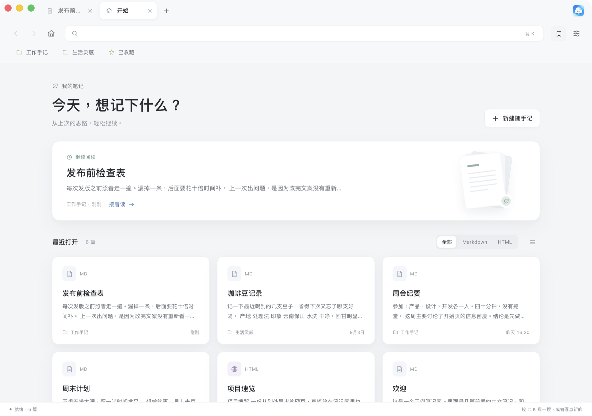
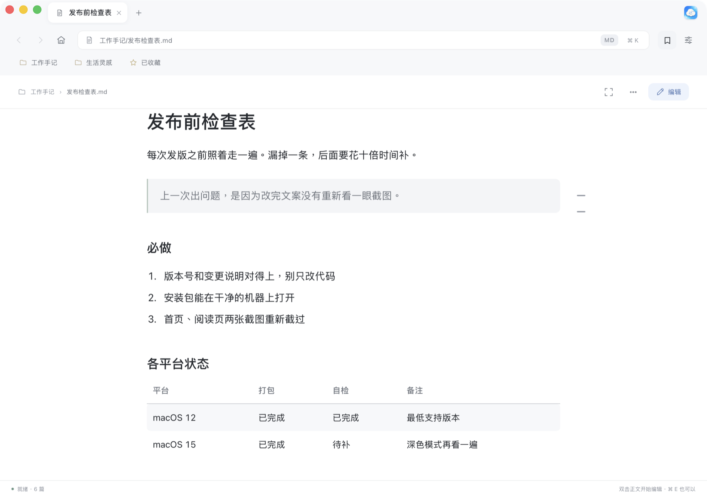
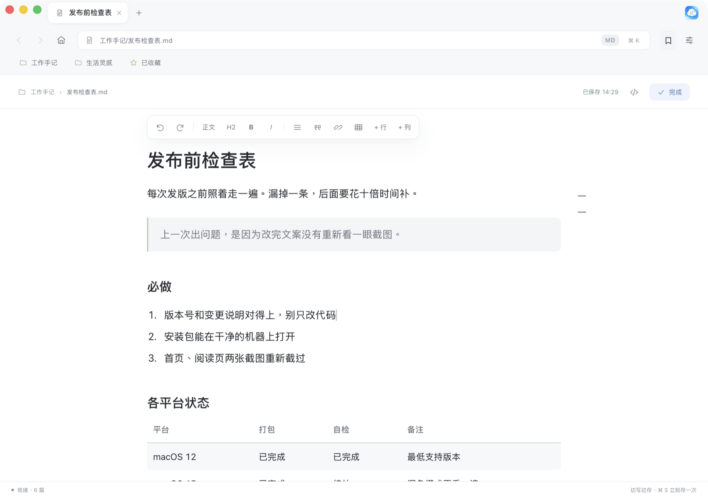

<p align="center">
  
</p>

<h1 align="center">AM·Note</h1>

<p align="center">
  macOS 上的本地 Markdown 笔记浏览器。<br>
  把电脑里任何一个文件夹当成笔记库来搜、来读、来改。<br>
  文件留在原地，不搬家，也不上传。
</p>

<p align="center">
  <a href="https://github.com/Qiululu667/amnote/releases"></a>
  <a href="LICENSE"></a>
  
</p>

## 它解决什么问题

电脑里已经攒了一堆 `.md`，还有几份从别处导出的 `.html`。它们散在下载、桌面、某个项目文件夹里，各自安好。

想找一句话，得先想它在哪个文件夹；想改一段，得挑一个编辑器打开。云笔记倒是能装下，但要先把文件搬进去——搬进去之后，它们就不是你的文件了。

AM·Note 不搬。选一个文件夹，它给你一个像浏览器一样轻的窗口：地址栏搜的是这个文件夹，标签页里读的是原来那些文件。改完，还是那些文件。



## 它是怎么工作的

1. 打开时选一个文件夹。任何文件夹都行，空的也行。
2. 它在这个文件夹里建一个 `.amnote/`，放索引和编辑备份。你的笔记一个字节都不动。
3. 窗口像浏览器：**地址栏**搜这个文件夹，**书签栏**是它的第一层子文件夹，每篇笔记占一个**标签页**。

## 能做什么

**找**

- 地址栏里打字，搜的是这个文件夹，不是网上。文件名和正文都搜。
- ⌘K 按名字直达，上下键选，回车打开。
- 书签栏点一下，看那个文件夹里有什么；⌘ 点直接进文件夹页。
- 卡片可以按「全部 / Markdown / HTML」筛，也可以在网格和列表之间切。

**读**

- md 和 html 都在标签里打开。库里的网页原样渲染，不用转格式。
- 开始页有「最近打开」，还有一张「继续阅读」——上次读到哪篇，一眼看见。
- 常看的按 ★ 收藏，书签栏最右边那个星就是收藏夹。
- 专注阅读：藏起地址栏和书签栏，只剩正文，Esc 退出。
- 阅读与外观：跟随系统 / 浅色 / 深色，正文字体，字号 15–21，宽度紧凑 620 / 舒适 690 / 宽阔 820。



**写**

- 双击正文进编辑，光标落在你双击的那一段。⌘E 也行。
- 选中文字浮出格式条：加粗、标题、列表、引用、链接、表格、加行加列。
- 停笔两秒自动存，顶栏显示「已保存 14:29」。⌘S 立刻存一次。
- 这份文件如果在别的编辑器里被改过，保存时会拦一下，让你选「保留我的」还是「改用对方的」。
- `</>` 切到整篇 Markdown 源码，改完再切回来。
- 截图直接粘进正文，图片落在这篇旁边的 `_图/` 里。



**整理**

- ⌘T 开新标签先到开始页；点「新建随手记」写下第一个标题，文件会自动照标题改名。
- ⌘⇧T 把刚关掉的标签搬回来。
- 在访达中显示、拷贝路径、分享、在新窗口打开——都在正文右上角的「⋯」里。
- 双击访达里的 `.md`，用它打开。

**外观**

- 浅色 / 深色 / 跟随系统，标题栏跟着一起变，和窗口是一块的。
- ⌃⌘S 切出左边的文件夹和列表；⌥⌘I 切出篇内目录。

## 它不做什么

- 不同步、不上传、不要账号。日常完全离线，只有你按「检查更新」时才联网。
- 不复制你的文件，也不改你的文件夹结构。
- 不锁格式。同一份文件随时可以用别的编辑器打开，两边一起用也行（它会提醒你有冲突）。
- 只认 `.md` 和 `.html`。别的类型的文件正文照样进索引、搜得到，但不在窗口里列出来，也不渲染。

## 安装

到 [Releases](https://github.com/Qiululu667/amnote/releases) 下载 `AMNote-mac.zip`，解开得到 `AM·Note.app`。

**第一次请右键图标 → 打开**，不要双击。没花钱做苹果签名，系统会问一次，点开就行。

需要 macOS 12 或更新。不用账号，不用联网。

想自己编：仓库根目录跑 `python3 src/build_app.py`，编完的 app 在 `dist/`。

## 第一次打开

1. 右键 `AM·Note.app` → 打开。
2. 选一个要索引的文件夹。点取消就退出。
3. 选完会记住。下次打开先到开始页，不会自动跳进上次那篇。

空文件夹也能用：能搜（0 条），能新建随手记。随手记默认落在所选文件夹下的 `随手记/`，没有就自动建。

想先试试，可以把它指到仓库里的 [`examples/demo-vault/`](examples/demo-vault)。

## 换一个文件夹

菜单「库 → 选择文件夹…」。原来那个文件夹和它的 `.amnote/` 都留着，换回去就还在。

## 更新

菜单「AM·Note → 检查更新…」。有新版可以直接装，装完会退出再打开，笔记还在原来的文件夹里。

从第二次启动起，大约一天查一次 GitHub Releases；同一个菜单里可以关掉「自动检查更新」。只问版本号和安装包，不上传任何东西。

已经装了旧版的，需要先手动下一次带「检查更新」的版本（5.1.0 起）；之后就不用再去 GitHub 了。

## 快捷键

| 键 | |
| --- | --- |
| ⌘T | 新建标签页（开始页） |
| ⌘N | 新建窗口 |
| ⌘W | 关闭当前标签（只剩开始页时关窗口） |
| ⌘⇧T | 恢复刚关掉的标签 |
| ⌘K | 快速直达 |
| ⌘L | 聚焦地址栏 |
| ⌥⌘K | 跳到搜索框 |
| ⌘E | 进入编辑 |
| ⌘S | 存储 |
| ⌘[ / ⌘] | 后退 / 前进 |
| ⇧⌘B | 显示书签栏 |
| ⌃⌘S | 显示列表 |
| ⌥⌘I | 显示检查器 |
| ⌘F | 在本页查找 |
| ⌥⌘O | 在新窗口打开 |
| ⇧⌘R | 在访达中显示 |
| ⌥⌘C | 拷贝路径 |
| ⌘, | 设置 |
| Esc | 关浮层 / 退专注 / 结束编辑 |

完整列表在 App 里：帮助 → 快捷键一览。

## 文件都放在哪

你的笔记还在原来那个文件夹里。多出来的只有一个 `.amnote/`：

| | |
| --- | --- |
| `fulltext.db` | 全文索引 |
| `changes.jsonl` | 改动流水（谁在什么时候动了哪份） |
| `backups/` | 编辑备份，每份文件留最近 10 版 |
| `config.json` | 这个库的设置（跳过哪些目录、端口范围、随手记目录…） |

删掉 `.amnote/`，笔记一份不少，只是下次打开要重新扫一遍。

- 随手记默认落在库里的 `随手记/`，目录名可以在设置里改。
- 粘贴进正文的图片，落在那份 md 旁边的 `_图/`。
- 服务的端口和口令在 `~/Library/Application Support/AMNote/` 下的 `portal.port` 和 `portal.token`（口令文件 0600）。

## 给 Agent / 脚本的本地接口

软件开着的时候，本机可以直接搜这个库。服务只监听 `127.0.0.1`，端口默认在 8870–8900 之间挑一个，**永不输出 CORS 头**——浏览器里的网页碰不到它。

读的路由不要口令，写的路由（所有 POST）要在头里带 `X-AMN-Token`。

```bash
D=~/Library/Application\ Support/AMNote
P=$(cat "$D/portal.port")
T=$(cat "$D/portal.token")

# 先确认服务还活着，不是 200 就别重试，改在文件夹里直接搜
curl -s -m 3 -o /dev/null -w '%{http_code}\n' "http://127.0.0.1:$P/__status"

# 搜整个库。中文词要用 --data-urlencode；n 默认 200，上限 500
curl -sG "http://127.0.0.1:$P/__search" \
     --data-urlencode "q=检查表" --data-urlencode "n=10"

# 库里有什么：目录树 + 全部 md/html + 随手记
curl -s "http://127.0.0.1:$P/__tree"

# 读一份 md 的源码
curl -sG "http://127.0.0.1:$P/__raw" --data-urlencode "path=工作手记/发布检查表.md"

# 写回去。要口令；「基于」填上一次读到的「改于」，别人改过就会被拦下来
curl -s -X POST "http://127.0.0.1:$P/__save" -H "X-AMN-Token: $T" \
     --data-binary '{"路径":"工作手记/发布检查表.md","正文":"# 标题\n\n正文\n","基于":"2026-09-05 09:42:00"}'
```

`/__save` 是全库唯一一条写路由，只写库根以内的 `.md`，写之前先留一版备份。

## 常见问题

**双击打不开，说文件已损坏 / 无法验证。** 没做苹果签名。右键图标 → 打开，系统会问一次，点开就行。

**索引在哪？** 在所选文件夹里的 `.amnote/`。它不进索引，也不会被搜到。

**删了 `.amnote/` 会怎样？** 笔记一份不少。下次打开重新扫一遍，编辑备份和改动流水会丢。

**能同时管好几个库吗？** 一个窗口一个库。菜单「库 → 选择文件夹…」换过去，两边的 `.amnote/` 各自留着，换回来接着用。

**和 Obsidian 或别的编辑器同时开着，会打架吗？** 不会覆盖。你在这边保存时，如果那份文件在别处被改过，顶上会出来一条提示，让你选「保留我的」还是「改用对方的」。

**要联网吗？** 不要。只有检查更新时会访问 GitHub。

## 许可

[MIT](LICENSE)
