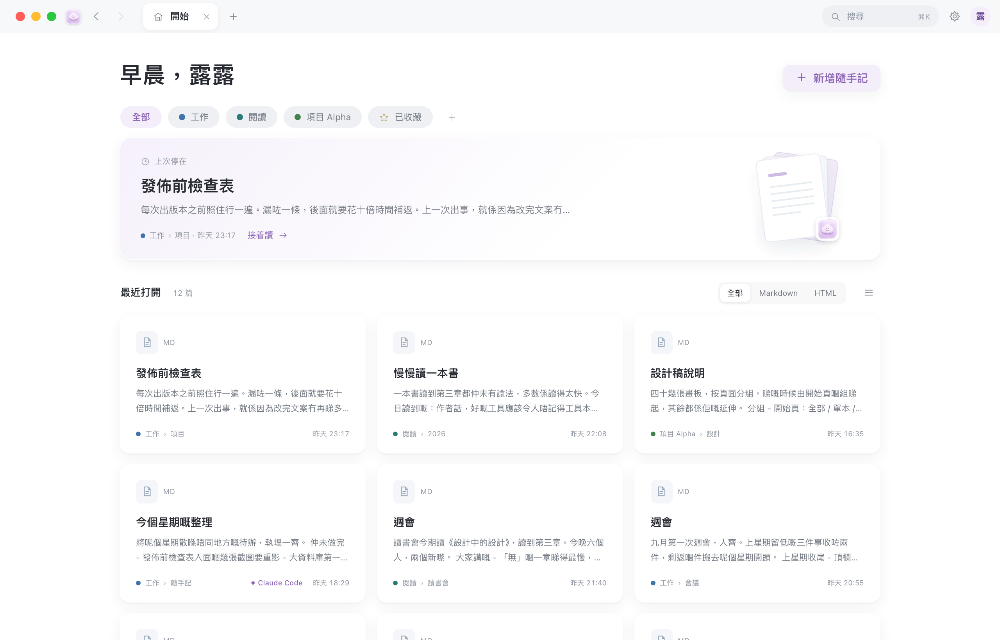
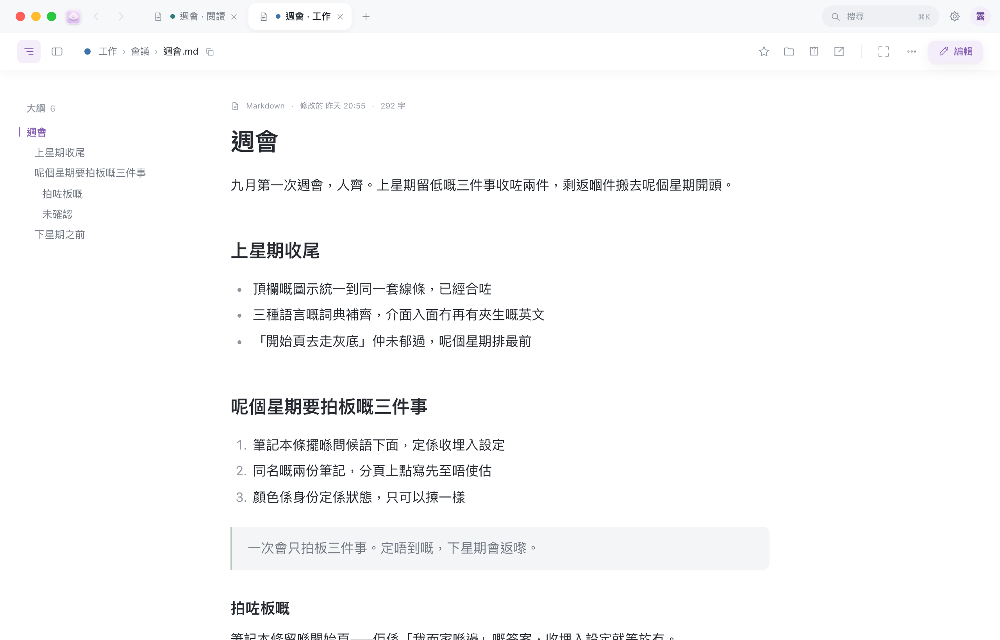
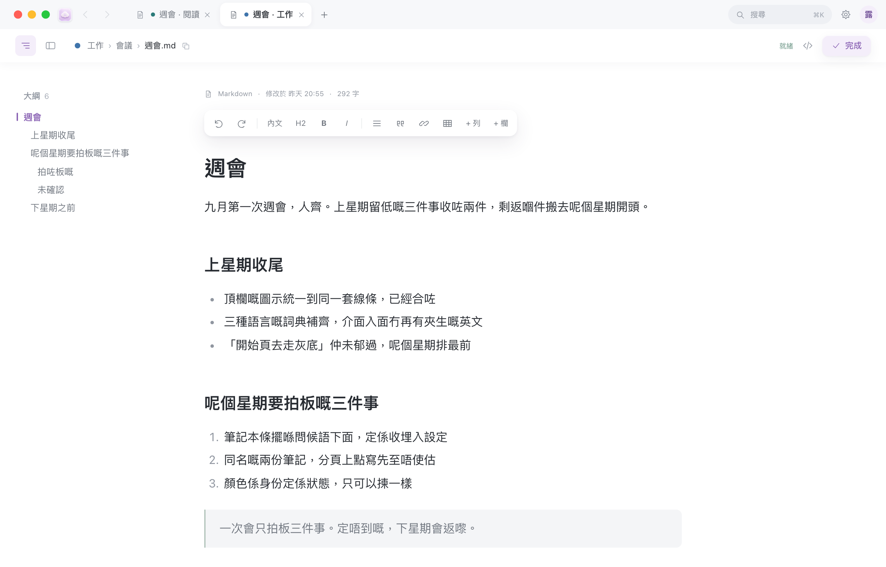

<p align="center">
  <a href="README.md">简体中文</a> ·
  <b>繁體中文（香港）</b> ·
  <a href="README.en.md">English</a>
</p>

<p align="center">
  
</p>

<h1 align="center">AM·Note</h1>

<p align="center">
  macOS 上的本機 Markdown 筆記瀏覽器。<br>
  把電腦裡一個或幾個資料夾當成筆記本，來搜、來讀、來改。<br>
  檔案留在原處，不搬家，也不上載。
</p>

<p align="center">
  <a href="https://github.com/Qiululu667/amnote/releases"></a>
  <a href="LICENSE"></a>
  
</p>

## 它解決什麼問題

電腦裡已經儲了一堆 `.md`，還有幾份從別處匯出的 `.html`。它們散在下載、桌面、某個專案資料夾裡，各自安好。

想找一句話，得先想它在哪個資料夾；想改一段，得挑一個編輯器打開。雲端筆記倒是裝得下，但要先把檔案搬進去——搬進去之後，它們就不是你的檔案了。

AM·Note 不搬。選一個資料夾，它給你一個像瀏覽器一樣輕的視窗：⌘K 搜的是這個資料夾，分頁裡讀的是原來那些檔案。改完，還是那些檔案。資料夾散在好幾處，就多選幾個，一個視窗一起看。



## 它是怎樣運作的

1. 第一次打開時選一個資料夾，或者讓它新增一個。任何資料夾都行，空的也行。這個資料夾就是一個**筆記本**。
2. 它在這個資料夾裡建一個 `.amnote/`，放索引和編輯備份。你的筆記一個位元組都不會動。
3. 視窗只有兩行：上面一行是分頁、搜尋和設定，每篇筆記佔一個**分頁**；下面一行寫着這份檔案在哪、能對它做什麼。搜整個資料夾按 **⌘K**。
4. 散在別處的資料夾想一起看，再加一個筆記本就是。只有一個筆記本時，介面和路徑跟以前完全一樣。

## 能做什麼

**找**

- ⌘K 是唯一的搜尋入口。打字，第一行就是「在全部筆記中搜尋『…』」，按 Return 搜內文，⌘ Return 在新分頁裡搜。
- 第一行下面是動作和筆記標題，上下鍵選，Return 打開。檔案名稱和內文都搜，搜的是這個資料夾，不是網上。
- 在開始頁直接打字也行，第一個字就把面板叫出來。
- 開始頁問候語下面是一行資料夾按鈕：庫裡的第一層資料夾，最後一枚是「已收藏」。按一下進去看有什麼，⌘ 按開新分頁；裡面還有子資料夾的話，下一行接着列，上面一行麵包屑隨時退回來。
- 卡片可以按「全部 / Markdown / HTML」篩選，也可以在格狀和列表之間切換。

**讀**

- md 和 html 都在分頁裡打開。庫裡的網頁原樣顯示，不用轉格式。
- 庫裡的 html 是在沙箱裡顯示的：腳本照跑，圖照畫，但那一頁拿不到 `localStorage`、`sessionStorage`、`cookie`、`indexedDB`（一碰就拋 SecurityError），也發不出請求去本機的服務。所以要存的東西寫進 md，別讓頁面自己記——下次打開它什麼都不記得。
- 開始頁有「最近打開」，還有一張「上次停在」的大卡——上次讀到哪篇，一眼看見，按「接着讀」就回去。
- 開始頁平時不顯示狀態；只有正在整理（「掃描中…」）或服務未啟動時，問候語旁邊才出一枚小點。視窗底下也不掛狀態列。
- 卡片上按 ★ 收藏，收起來的都在「已收藏」那枚按鈕裡。
- 內文上面那一行是文件標題列：左邊是大綱開關、關聯開關和這份檔案的路徑，按一下路徑就把它拷走，⌘ 按其中一段資料夾名稱，在新分頁裡打開那個資料夾；右邊依次是收藏、在 Finder 中顯示、分享、在新視窗中打開，再往右是專注、「⋯」和「編輯」。
- 左側大綱：標題層級一目了然，讀到哪一節自動加亮，按一下跳過去。⌥⌘I 收起或叫回來。
- 左側「關聯」：這篇周圍有什麼——所在資料夾（能一路展開成整本的檔案樹，目前這篇加亮）、同一篇的其他版本（`_v1`、`v3 終版`、`20260827_` 開頭、同名的 .html 都歸到一起）、連到誰和被誰連到。預設關着，⌥⌘R 叫出來；它和大綱共用左邊那一欄，一次只顯示一個。
- 專注閱讀：按 ⤢，文件標題列、大綱和關聯一起收起來，只剩內文；滑鼠碰一下視窗頂邊它們就滑回來，Esc 退出。



**寫**

- 按兩下內文進編輯，游標落在你按的那一段。⌘E 也行。
- 選取文字浮出格式條：粗體、標題、列表、引用、連結、表格、加列加欄。
- 停筆兩秒自動儲存，右上角顯示「已儲存 14:29」。⌘S 立刻存一次，寫完按「完成」收工。
- 這份檔案如果在別的編輯器裡被改過，儲存時會攔一下，讓你選「保留我的」還是「改用對方的」。
- 按「看 Markdown 原始碼」切到整篇原始碼，改完再切回來。
- 螢幕截圖直接貼進內文，圖片落在這篇旁邊的 `_图/` 裡。



**整理**

- ⌘T 開新分頁先到開始頁；按「新增隨手記」寫下第一個標題，檔案會自動照標題更名。
- ⌘⇧T 把剛關閉的分頁叫回來。
- 在 Finder 中顯示、分享、在新視窗中打開，都是文件標題列右邊那幾個小圖像；拷貝路徑按一下路徑就行。列印和「打開所在資料夾」在「⋯」裡。
- 建錯的隨手記：「⋯」→ 移到垃圾桶，或按 ⌘⌫；幾秒內可以在提示裡復原，檔案在系統垃圾桶裡也能找回。
- 在 Finder 裡按兩下 `.md`，就用它打開。

**幾個筆記本**

- 一個資料夾就是一個**筆記本**。加了第二個之後，開始頁問候語下面多一行筆記本按鈕：`全部 | ● 工作 | ● 讀書 | ☆ 已收藏 | ＋`，資料夾按鈕、卡片、搜尋範圍和新增落點都跟着它走。
- 每本一種顏色。卡片、路徑按鈕、分頁和 ⌘K 結果上都帶這枚色點，一眼知道在哪一本裡；紫色仍舊只表示「選中」。
- 「全部」是總覽：「上次停在」、最近和搜尋跨着所有筆記本。想看資料夾按鈕，先按一本——那一刻的頁面就是從前的開始頁。
- 新增隨手記（⌥⌘N）落在那一行選中的那本，選着「全部」時落預設那本。提示條寫「已在 ● 工作 新增」，按「換一個」還能搬到別本去。
- 幾本時路徑帶上本名，像 `工作/會議/週會.md`。每個筆記本各有各的 `.amnote/`；資料夾一時找不到（外置硬碟沒插），那枚按鈕壓灰寫「找不到」，不會替你移除。
- **只有一個筆記本時，和以前完全一樣**：沒有那一行按鈕，沒有色點，路徑不帶前綴。

**設定**

- ⌘, 打開，或者按右上角那顆 ⚙。六頁：個人、閱讀與外觀、筆記庫、Agent、進階、關於。
- 個人：起個名字、放張頭像，開始頁就按時段跟你打招呼（「早晨，露露」）。資料只留在這部 Mac 上。
- 介面語言：跟隨系統 / 简体中文 / 繁體中文（香港）/ English。原生選單和網頁一起換，切換後會重新載入頁面。
- 閱讀與外觀：跟隨系統 / 淺色 / 深色，內文字體（系統黑體、宋體、等寬、蘋方-港、新細明體，卡片上先看到樣子），字體大小 15–21，行距緊湊 1.6 / 舒適 1.8 / 寬鬆 2.0，欄寬窄 620 / 標準 690 / 寬 820，還有「打開文件時預設顯示大綱」。換深色時標題列跟着一起變，和視窗是一塊的。
- 兩款新的閱讀字體：**蘋方-港**有極細到中粗六檔字重可選；**新細明體**本機沒裝的話，會借用已安裝的 Microsoft Office 裡那一份，連 Office 都沒有就用宋體-繁代替。
- 筆記庫：用的是哪些資料夾——加入、改名、換顏色、設為預設、移除都在這裡；收了多少篇、上次掃描是什麼時候，也可以讓它重新掃描一遍；隨手記放在哪個資料夾；哪些資料夾不收錄（後面這兩樣每個筆記本各存各的）。
- 進階預設摺着——略過的檔案、本機服務連接埠都在裡面。連接埠只認第一個筆記本那一格：一個程序一個連接埠。關於那頁有版本號、「檢查更新」和自動檢查的開關。

## 它不做什麼

- 不同步、不上載、不用帳戶。日常完全離線，只有你按「檢查更新」時才連網。
- 不複製你的檔案，也不改你的資料夾結構。
- 不鎖格式。同一份檔案隨時可以用別的編輯器打開，兩邊一起用也行（它會提醒你有衝突）。
- 只認 `.md` 和 `.html`。別的類型的檔案內文照樣進索引、搜得到，但不在視窗裡列出來，也不顯示。

## 安裝

到 [Releases](https://github.com/Qiululu667/amnote/releases) 下載 `AMNote-mac.zip`，解開得到 `AM·Note.app`。

**第一次請在圖像上按右鍵 → 打開**，不要按兩下。沒花錢做蘋果簽名，系統會問一次，按打開就行。

需要 macOS 12 或以上。不用帳戶，不用連網。

想自己編譯：在儲存庫根目錄執行 `python3 src/build_app.py`，編好的 app 在 `dist/`。

## 第一次打開

1. 在 `AM·Note.app` 上按右鍵 → 打開。
2. 視窗上是一張歡迎卡，兩個選擇：**新增一個筆記庫**，在「文件」裡建一個 `AM·Note` 資料夾，附一篇歡迎筆記；**使用現有資料夾**，選一個已經放着 Markdown 或網頁的資料夾。
3. 選完它掃描一遍，告訴你找到了多少篇，然後就是開始頁。第一次進去還有一張「第一次用？三件事就夠」的小卡片，按「知道了」就不再出現。

選完會記住。下次打開先到開始頁，不會自動跳進上次那篇。

空資料夾也能用：能搜（0 項），能新增隨手記。隨手記預設落在所選資料夾下的 `随手记/`，沒有就自動建。

上次那個資料夾要是被搬走或者刪了，它不會結束，只會問你「重新選擇位置…」還是「新增一個筆記庫」。檔案不會遺失，只是它找不到那個資料夾。

兩本以上時，找不到的只是那一本：那一行按鈕上它壓灰寫「找不到」，設定裡那一行有「重新定位…」，別的本照用。

想先試試，可以把它指到儲存庫裡的 [`examples/demo-vault/`](examples/demo-vault)。

## 管理筆記本

設定（⌘,）→ 筆記庫。兩本以上時這一段是一列筆記本：色塊按開八色盤，名字就地改，灰字路徑按一下在 Finder 裡打開，右邊是「設為預設」和「移除」。清單下面是「加入筆記本…」，選單「筆記庫 → 加入筆記本…」是同一件事。

移除只是把這條登記註銷掉：檔案不動，`.amnote/` 也留着，哪天再加回來就接着用。至少要留一個。資料夾被搬走的那本壓灰，那一行有「重新定位…」。

只有一本時這一段還是從前那張「目前的筆記庫」卡片，「更換資料夾…」也還在。

## 更新

選單「AM·Note → 檢查更新…」，設定的「關於」那頁也有同一顆按鈕。有新版可以直接裝，裝完會結束再打開，筆記還在原來的資料夾裡。

從第二次開啟起，大約一日查一次 GitHub Releases；選單裡和設定裡都能關掉「自動檢查更新」。只問版本號和安裝套件，不上載任何東西。

已經裝了舊版的，需要先手動下載一次帶「檢查更新」的版本（5.1.0 起）；之後就不用再去 GitHub 了。

## 快速鍵

| 鍵 | |
| --- | --- |
| ⌘T | 新增分頁（開始頁） |
| ⌘N | 新增視窗 |
| ⌥⌘N | 新增隨手記 |
| ⌘W | 關閉目前分頁（只剩開始頁時關閉視窗） |
| ⌘⇧T | 還原剛關閉的分頁 |
| ⌘K | 搜尋 / 快速直達 |
| ⌘L、⌥⌘K | 也是打開同一個搜尋面板 |
| ⌘E | 進入編輯 |
| ⌘S | 儲存 |
| ⌘⌫ | 移到垃圾桶 |
| ⌘[ / ⌘] | 返回 / 前進 |
| ⌃Tab | 換一個分頁 |
| ⌥⌘I | 顯示大綱 |
| ⌥⌘R | 顯示關聯 |
| ⌘F | 在本頁尋找 |
| ⌥⌘O | 在新視窗中打開 |
| ⇧⌘R | 在 Finder 中顯示 |
| ⌥⌘C | 拷貝路徑 |
| ⌘, | 設定 |
| Esc | 關閉浮層 / 退出專注 / 結束編輯 |

按一篇筆記，在目前分頁裡打開（已經開着就切過去）；⌘ 按就開一個新分頁。開始頁、搜尋結果、⌘K、關聯面板都是這個規矩。

完整清單在 App 裡：輔助說明 → 快速鍵一覽。

## 檔案都放在哪

你的筆記還在原來那個資料夾裡。多出來的只有一個 `.amnote/`：

| | |
| --- | --- |
| `fulltext.db` | 全文索引 |
| `changes.jsonl` | 改動流水（誰在什麼時候動了哪份） |
| `backups/` | 編輯備份，每份檔案留最近 10 版 |
| `config.json` | 這個庫的設定（略過哪些資料夾、連接埠範圍、隨手記資料夾…） |

刪掉 `.amnote/`，筆記一份不少，只是下次打開要重新掃一遍。

- 隨手記預設落在庫裡的 `随手记/`，資料夾名稱在 設定 → 筆記庫 裡改。
- 貼進內文的圖片，落在那份 md 旁邊的 `_图/`。
- 庫根還可能多兩份，都是 設定 → Agent 裡按出來的，不按就沒有：`AGENTS.md`（給在這個資料夾裡跑的 agent 的說明）和 `库地图.md`（匯出的筆記庫地圖，重新匯出會整份蓋掉，別在裡面手寫東西）。
- 筆記本名單在 `~/Library/Application Support/AMNote/notebooks.json`：每本的名字、顏色和路徑。它只記「用了哪些資料夾」，筆記一個字都不在裡面。
- 服務的連接埠和口令在同一個資料夾下的 `portal.port` 和 `portal.token`（口令檔 0600）。還有 `profile.json` 和 `avatar.img`——你的暱稱和頭像，只在這部 Mac 上。

## 給 Agent／腳本的本機介面

AM·Note 開着的時候，這部 Mac 上的 AI 助手可以搜尋和讀寫這個筆記庫。只在本機，不連網。

**三步接上**

1. 設定（⌘,）→ Agent。
2. 用 Claude Code 就按「安裝 Skill」；用 Codex 或別的工具，按「拷貝 MCP 指令」或「拷貝 MCP 設定」，貼進它自己的設定裡。
3. 回 Claude Code 直接說「幫我在筆記裡找一下上次那份發佈檢查表」。

Skill 教它的是一套次序：先問**有哪些筆記本**，再看**筆記庫地圖**知道有哪些資料夾，然後**搜尋**定位，最後只**讀那一節**——不用把整個庫灌進上下文。

在庫資料夾裡跑的 agent（Codex、Cursor…）還可以按「在筆記庫生成 AGENTS.md」，它開工先讀到同一套規矩。旁邊那顆「匯出到筆記庫」寫一份 `库地图.md`，AM·Note 沒開着時也看得到。

**命令列 `amnote`**

設定 → Agent → 命令列工具 →「安裝」，在 `~/.local/bin/amnote` 建一條符號連結，指到 app 裡的 `AM·Note.app/Contents/Resources/amnote`。不裝也行，直接叫那個絕對路徑一樣用。

```bash
amnote notebooks                              # 有哪些筆記本、哪本是預設
amnote map                                    # 庫裡有哪些資料夾、每篇講什麼
amnote search "報銷" --dir 工作筆記 --since 7   # 空格分詞＝AND，還能 --type md,pdf
amnote outline 工作筆記/報銷.md                # 這份有哪些小節
amnote read 工作筆記/報銷.md --section "發票"   # 只讀那一節
amnote recent                                 # 最近改了什麼
amnote new "會議記錄 0906" < 內文.md           # 新增，預設落在隨手記資料夾
amnote save 工作筆記/報銷.md < 內文.md          # 整篇覆寫；要先 read 過這份（它記得你讀到的版本），或加 --based/--force

# 兩本以上時：路徑以筆記本名開頭，多數命令加 -n 名字只看一本
amnote read 工作/會議/週會.md
amnote map -n 讀書
amnote search "週會" --notebook 工作            # search 和 recent 上的 -n 是「要幾條」，只能寫長的
amnote new "會議記錄 0906" -n 讀書              # 不給 -n 就落在預設那本的隨手記資料夾
```

路徑一律是**庫相對路徑**；兩本以上時它以筆記本名開頭（`工作/會議/週會.md`），`amnote notebooks` 列出有哪些本。每條都能加 `--json` 拿原樣的 JSON，`--agent 名字` 給這次改動署名。

AM·Note 沒開着時，只讀的那幾條會用 `.amnote/` 裡上一次的索引接着答（會在 stderr 說一聲），寫不了。

結束代碼：0 成功 · 1 用法錯（含「沒讀過就 save」）· 2 AM·Note 沒有開着 · 3 衝突（這份在你讀完之後被別處改過，加 `--force` 才蓋）· 4 服務端拒絕。

**MCP**

```bash
claude mcp add amnote -- /路徑/到/amnote mcp
```

Codex 的 `~/.codex/config.toml` 裡加：

```toml
[mcp_servers.amnote]
command = "/路徑/到/amnote"
args = ["mcp"]
```

九個工具：`list_notebooks`、`search_notes`、`note_map`、`read_note`、`note_outline`、`recent_notes`、`note_links`、`create_note`、`save_note`。幾本時先叫 `list_notebooks`；`search_notes`、`note_map`、`recent_notes`、`create_note` 都有一個可選的 `notebook`。設定 → Agent 裡那兩顆「拷貝」按鈕已經把路徑填好了。

**直接走 HTTP**

寫腳本，或者用別的語言接，直接叫路由也行。服務只監聽 `127.0.0.1`，連接埠預設在 8870–8900 之間選一個，**永不輸出 CORS 標頭**——瀏覽器裡的網頁碰不到它。讀的路由不用口令，寫的路由（所有 POST）要在標頭裡帶 `X-AMN-Token`。

> JSON 欄位名（`路径`、`正文`、`基于`…）是介面約定，任何介面語言下都保持簡體中文原樣。

```bash
D=~/Library/Application\ Support/AMNote
P=$(cat "$D/portal.port")
T=$(cat "$D/portal.token")

# 先確認服務還活着，不是 200 就別重試，改叫 amnote（它會退到上次的索引）
# /__status 裡的「模式」是「单」還是「多」，「笔记本」是那份名單
curl -s -m 3 -o /dev/null -w '%{http_code}\n' "http://127.0.0.1:$P/__status"

# 有哪些筆記本：名字、顏色、路徑、收錄、哪本是預設
curl -s "http://127.0.0.1:$P/__notebooks"

# 筆記庫地圖：一份 Markdown 的「這個庫裡有什麼」，開工先看它。
# dir= 只畫一個資料夾，max= 每個資料夾列幾篇（預設 20），depth= 資料夾深度
curl -sG "http://127.0.0.1:$P/__map" --data-urlencode "dir=工作筆記"

# 搜整個庫。中文詞要用 --data-urlencode；n 預設 200，上限 500。
# 還能篩：dir=資料夾、type=md,pdf、since=7 或 since=2026-09-01、sort=mtime、offset=20
curl -sG "http://127.0.0.1:$P/__search" \
     --data-urlencode "q=檢查表" --data-urlencode "n=10" \
     --data-urlencode "dir=工作筆記" --data-urlencode "since=7"

# 這一份有哪些小節：每個標題的級、文字、行號
curl -sG "http://127.0.0.1:$P/__outline" --data-urlencode "path=工作筆記/發佈檢查表.md"

# 讀一份 md 的原始碼。整份，或者 section=標題 只要那一節、lines=5-40 只要那幾行
curl -sG "http://127.0.0.1:$P/__raw" \
     --data-urlencode "path=工作筆記/發佈檢查表.md" --data-urlencode "section=打包"

# 這篇指向誰、誰指向它
curl -sG "http://127.0.0.1:$P/__links" --data-urlencode "path=工作筆記/發佈檢查表.md"

# 最近改了什麼。days 預設 7、上限 365，n 預設 50、上限 500
curl -sG "http://127.0.0.1:$P/__recent" --data-urlencode "days=7"

# 庫裡有什麼：目錄樹 + 全部 md/html + 隨手記
curl -s "http://127.0.0.1:$P/__tree"

# 寫回去。要口令；「基于」填上一次讀到的「改于」，別人改過就會被攔下來。
# 帶上名字，卡片上會顯示是誰改的
curl -s -X POST "http://127.0.0.1:$P/__save" \
     -H "X-AMN-Token: $T" -H "X-AMN-Agent: 我的腳本" \
     --data-binary '{"路径":"工作筆記/發佈檢查表.md","正文":"# 標題\n\n內文\n","基于":"2026-09-05 09:42:00"}'

# 移到系統垃圾桶。只搬位置不改內容，認 .md / .html / .htm
curl -s -X POST "http://127.0.0.1:$P/__trash" -H "X-AMN-Token: $T" \
     --data-binary '{"路径":"工作筆記/建錯了.md"}'

# 把剛才那份移回原位。復原表只在記憶體裡，服務重啟過就復原不了，去垃圾桶找
curl -s -X POST "http://127.0.0.1:$P/__untrash" -H "X-AMN-Token: $T" \
     --data-binary '{"路径":"工作筆記/建錯了.md"}'
```

`/__search` 每條命中帶 `路径`、`标题`、`类型`、`改于`、`大小`、`分数`，下面掛幾段 `片段`，每段帶 `行`（行號）和 `小节`（命中落在哪個標題下）。照着 `小节` 去 `/__raw?section=` 取那一節，別整份讀回來。

兩本以上時路徑一律以筆記本名開頭，`/__search`、`/__recent`、`/__changes`、`/__map`、`/__config`、`/__archive` 都認 `nb=名字`（逗號可以寫好幾本）限定範圍；`dir=工作/會議` 自帶前綴，等於也限定了那一本。`/__changes` 的序號是按本各自數的，要用 `since=` 取增量就一次只問一本。

`X-AMN-Agent` 所有 POST 都認：流水上記成「来源 Agent · 代理 你的名字」，卡片上也會多一行 `✦ 你的名字`。

改檔案內容的只有 `/__save` 一條，只寫庫根以內的 `.md`，寫之前先留一版備份。另外兩條搬位置的是 `/__trash` 和 `/__untrash`：檔案原樣進出系統垃圾桶，一個位元組都不會動。備份資料夾、快取資料夾、隱藏資料夾一律不給動。

## 常見問題

**按兩下打不開，說檔案已損毀 / 無法驗證。** 沒做蘋果簽名。在圖像上按右鍵 → 打開，系統會問一次，按打開就行。

**索引在哪？** 在所選資料夾裡的 `.amnote/`。它不進索引，也不會被搜到。

**刪了 `.amnote/` 會怎樣？** 筆記一份不少。下次打開重新掃一遍，編輯備份和改動流水會沒了。

**能同時管好幾個資料夾嗎？** 可以。設定 → 筆記庫 →「加入筆記本…」，加進來的每個資料夾就是一個筆記本，一個視窗一起看。各自的 `.amnote/` 各存各的；移除只是註銷登記，檔案不動。

**和 Obsidian 或別的編輯器同時開着，會撞車嗎？** 不會覆蓋。你在這邊儲存時，如果那份檔案在別處被改過，頂上會出來一條提示，讓你選「保留我的」還是「改用對方的」。

**Agent 改了我的筆記我怎麼知道？** 卡片上會多一行 `✦ Claude Code`——這一篇最近一次是本機哪個 AI 助手寫的，七天內都標着。要看細賬翻 `.amnote/changes.jsonl`，每條都記着「来源」和「代理」。

**暱稱和頭像儲存在哪？** `~/Library/Application Support/AMNote/` 下的 `profile.json` 和 `avatar.img`。它們跟着這部 Mac 走，不進筆記本，也不上載，加一本、換一本都不用重新設定。不想被打招呼，設定 → 個人 裡把「開始頁向我問好」關掉。

**要連網嗎？** 不用。只有檢查更新時會存取 GitHub。

## 授權

[MIT](LICENSE)
